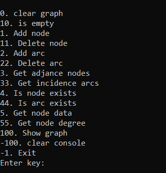

# Description

I **implemented** a templated container class to represent a **directed graph** using an **incident matrix**.

**Graph output** occurs in the form of an **incident matrix**.

# Content
- All classes are template
- typedef val_type
- Iterators:
  - node_iterator
  - const_node_iterator
  - reverse_node_iterator
  - arc_iterator
  - const_arc_iterator
  - reverse_arc_iterator
- operators:
  - ==
  - !=
  - < >
  - <= >=
  - <<
- methods:
  - __add_node__ and __add_arc__
  - __delete_node__ and __delete_arc__
  - __is_node_exists__ and __is_arc_exists__
  - __get_nodes_count__ and __get_arcs_count__
  - __get_node_degree__ and __get_arc_degree__
  - __get_node_data__
  - __is_empty__
  - __clear_graph__

# Menu

To **create a graph** you can use **menu()** method. 

# To conclude

For **more information** you can read **report.docx**